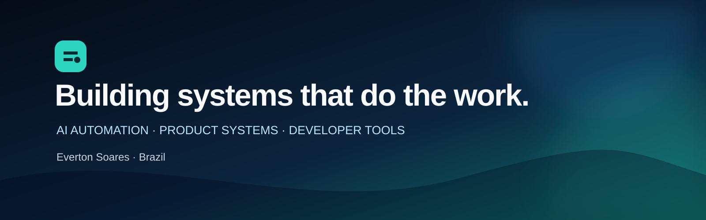
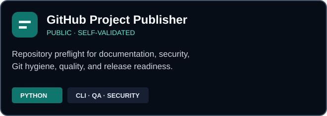
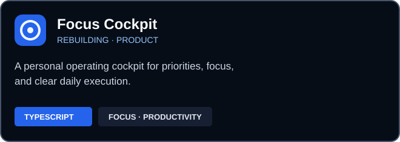
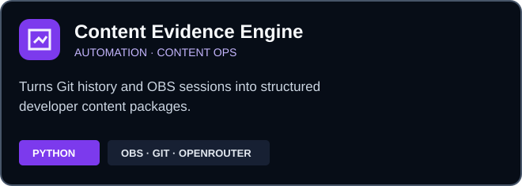
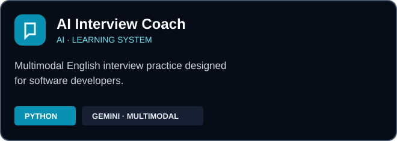
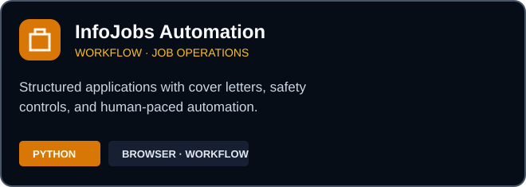
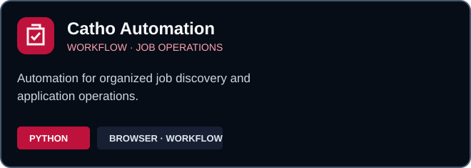

  

  <strong>AI Automation &amp; Product Systems Builder</strong> 
  I turn repetitive workflows into practical software.

  
  
  

## About

I build practical AI tools, autonomous workflows, and developer products. My work focuses on
turning complex or repetitive operations into systems that are understandable, reusable, and
safe to run.

Currently building **GrowthTech AIOS** — an ecosystem for automation, focus, project quality,
and intelligent operations.

## Selected Projects

| | |
| :---: | :---: |
|  |  |
|  |  |
|  |  |

## What I Build

| AI systems | Automation | Developer products |
| --- | --- | --- |
| Useful agents and intelligent workflows | Repeatable operations with human control | Tools built to be understood and reused |

## Working Principles

- Automate repetitive work while keeping important decisions visible.
- Treat documentation, security, and validation as part of the product.
- Build systems that solve real operational problems.
- Ship clear projects that another person can understand and run.

## Current Focus

- Rebuilding **Focus Cockpit** as a focused product rather than a collection of features.
- Evolving **GitHub Project Publisher** from repository audit to a safe review-and-apply workflow.
- Building the foundations of **GrowthTech AIOS**.

---

  Building from Brazil · Open to conversations about AI automation, product systems, and developer tools.

